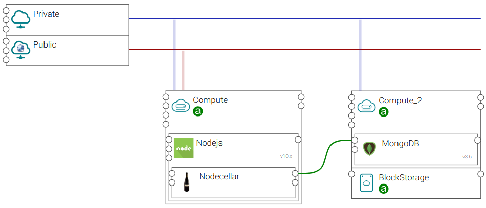

# tosca-tutorials

## Overview

TOSCA is a YAML file that describes a topology of a cloud application (just like the OpenStack HOT template, or the AWS
Cloud Formation). The main difference is that TOSCA not only describes the **cloud infrastructure** but also the 
**software components**, and the **relationships** between the software components in one stack. Afterwards, a TOSCA orchestration engine
read the topology description and deploy the applications in multiple cloud providers.

Figure 1 shows an example, whereby users describe their applications with three points:
1. the cloud infrastructure (e.g., public / private `network`, `compute` nodes, and `block storage`). 
2. the software components (e.g., a `nodejs` software component is deployed on the `Compute` node, a `mongodb`
software component is deployed on the `Compute_2` node). Here users can control the lifecycle of the software components
(i.e., how they are installed, updated, deleted) with ansible, python, and shell script.
3. the relationships between the software components (e.g., a `nodecellar` web application connects to the `mongodb`
on port 27017). Here users can configure the `nodecellar` (i.e., the source node) and `mongodb` (i.e., the target node)
to setup the relationship between them with ansible, python, and shell script.

Figure 1: TOSCA example

The following tutorial shows how users use TOSCA to do so.

## Basic
1. [How to manage the lifecycle (create, update, delete) of a software component on a compute node?](tutorials/Basic_Lifecycle.md "Python example")
2. [How to create a software component using an ansible playbook?](tutorials/Basic_Ansible.md "Ansible example")
3. [How to define a `ConnectsTo` relationship between two software components?](tutorials/Basic_Relationship_ConnectsTo.md "Relationship connects to example")
4. [How to define a custom capability?](tutorials/Basic_Custom_Capability.md "Custom capability")
5. [How to deploy a file or a folder (i.e., a `File` artifact) to a target compute node?](tutorials/Basic_Artifact.md "Artifact")

## Container
1. How to define a docker container application?
2. How to deploy a docker container on Kubernetes?

## Author
* [Tri Hoang Vo](https://www.linkedin.com/in/tri-hoang-vo-395819aa/ "Tri linkedin")

## Copyright
* TOSCA Tutorials brought to you by [Open Telekom Cloud](https://open-telekom-cloud.com), T-Systems International GmbH.
* The examples we used in this tutorial are from [Yorc](https://github.com/ystia/tosca-samples).