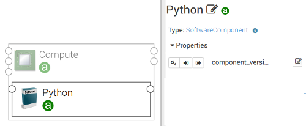

# 1. Manage the lifecycle of a software component on a compute node

The following example shows how to create a software component (e.g., a python script) and run it a on compute node.

#### Step 1. Import TOSCA types

This example extends the TOSCA type `tosca.nodes.SoftwareComponent`, so we need to import the TOSCA type definition as 
follows:

```yaml
imports:
  - tosca-normative-types:1.0.0-ALIEN20
```

#### Step 2. Define a new node type

Now we define a new node type (e.g., `otc.nodes.SoftwareComponent.Python`) for our python script by deriving it from an 
existing node type `tosca.nodes.SoftwareComponent`:

```yaml
node_types:
  # This is the node name, can be arbitrary
  otc.nodes.SoftwareComponent.Python:
    derived_from: tosca.nodes.SoftwareComponent
```

By deriving from the `SoftwareComponent`, the python component can be hosted on a compute node by default 
as in Figure 1.



Figure 1: A Python component

The `SoftwareComponent` also comes up with the default property `component_version`. Therefore, the Python component 
also inherits this property (see Figure 1). In the editor, users can specify the value for the property.

#### Step 3. Define a custom node properties

The below example shows how to define a custom property `hello_message` from type `string` for our node. The property is 
set to the default value `Hello World!`. The `required` field indicates that users have to specify a value for this 
property in the editor.

```yaml
  otc.nodes.SoftwareComponent.Python:
    ...
    properties:
      hello_message:
        description: A simple message to print
        type: string
        required: true
        default: "Hello World!"
```

TOSCA also supports the following data types:
* YAML Types: `integer`, `string`, `boolean`, `float`
* TOSCA types: 
  * `version`: 2.0.1
  * `range`: [0, 100], [ 0, UNBOUNDED ]
  * `list`: [ 80, 8080 ]
  * `map`: { user1: 1001, user2: 1002 }

#### Step 4. Define the interfaces

The interfaces are the main implementations, where we can control the lifecycle of our node. The TOSCA orchestration 
engine will call the interfaces at runtime during the lifecycle of the node: `create`, `start`, `update`, `delete`.

In the following example, the orchestrator calls a python script `start.py` to `start` the python node. The script has 
the input variable `msp`, which value is set from the property `hello_message` of the node.

```yaml
  otc.nodes.SoftwareComponent.Python:
    ...
    properties:
      hello_message:
    ...
    interfaces:
      Standard:
        start:
          inputs:
            # the keyword SELF indicates the node itself.
            msg: {get_property: [SELF, hello_message]}
          implementation: scripts/start.py
```

Notice: 
* We use the `SELF` keyword to get information of the node itself (e.g., the property `hello_message` of the current 
python node).

The input param `msp` of the `start` interface is available as an environment variable in the script `start.py`:

```python
# scripts/start.py
print(msg)
```

Notice:
* TOSCA supports the following scripts: python, shell script, ansible.

#### Step 5. Define the output value

We can define the runtime output for our python component by defining the `attributes`:

```yaml
    interfaces:
      Standard:
        create:
          inputs:
            var1: {get_property: [SELF, outputVar1]}
          implementation: scripts/create.py
    attributes:
      resolvedOutput1: { get_operation_output: [SELF, Standard, create, myVar1]}
```

In the above example, the python node outputs the attribute `resolvedOutput1`. It is set from the environment variable 
`myVar1` of the `create` interface. In particular, `myVar1` is an environment variable in the python script of the 
`create` interface:

```python
# scripts/create.py
from os import environ
# Set output val using two different ways
myVar1="Resolved {0}".format(var1)
```

#### Step 6. Package

* To package the TOSCA definition: zip all contents **inside** the folder examples/python/*
* Upload the zip file to the service catalog.

#### Where to go from here?

* See [full example](../examples/python/types.yaml "Python example")
* Next: [How to create a software component using an ansible playbook?](Basic_Ansible.md "Ansible example")