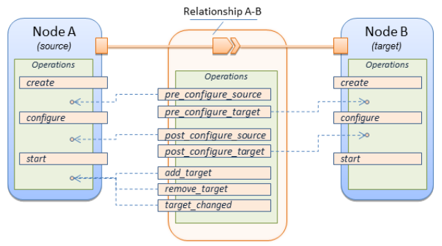

# 3. Define a `ConnectsTo` relationship between two software components

This example shows how to define a `ConnectsTo` relationship from nodecellar (a `SOURCE` node) to mongodb (a `TARGET`
node)as in Figure 1.


Figure 1: A topology with nodecellar connects to mongodb on a compute node.

#### Step 1. Define an endpoint capability in the TARGET node (mongodb)

In the mongodb node, add the following `capabilities` block:

```yaml
node_types:
  otc.nodes.SoftwareComponent.MongoDB:
    ...
    capabilities:
      mongo_db:
        type: tosca.capabilities.Endpoint.Database
```

In this example, the new capability `mongo_db` is from type `tosca.capabilities.Endpoint.Database`.

The capability `mongo_db` willl show in the editor as in Figure 2:


Figure 2: the mongodb node now has a capability `mongo_db`

Notice:
* The `tosca.capabilities.Endpoint.Database` is a TOSCA normative type with some default properties and attributes. By 
deriving from this type, the capability `mongo_db` also has these properties as in Figure 2.
* The capability `mongo_db` now contains information for a `SOURCE` node to setup the connection in step 3.
* In the editor, users can specifiy values for the `mongo_db` capability. For example. users may set the `port`to 27017.
* The `tosca.capabilities.Endpoint` also has a default attribute `ip_address` (not shown in the Figure). The
orchestrator will automatically set the IP address of the hosted compute node to this attribute. A `SOURCE` node can use
the `ip_address` to setup a connection in step 3.

#### Step 2. Define a requirement in the SOURCE node (nodecellar)

In the nodecellar node, add the following `requirements` block:

```yaml
node_types:
  otc.nodes.WebApplication.Nodecellar:
    derived_from: tosca.nodes.WebApplication
    ...
    requirements:
      - mongo_db:
          # nodecellar connects to a node that has the capability Endpoint.Database
          capability: tosca.capabilities.Endpoint.Database
          # nodecellar uses this relationship to setup the connection
          relationship: otc.relationships.NodejsConnectToMongo
```

Notice:
* The requirement name of nodecellar node has the same name `mongo_db` as the capability name in the mongodb node.

#### Step 3: Define the relationship

Define the relationship `otc.relationships.NodejsConnectToMongo` for nodecellar to setup the connection with mongodb:

```yaml
relationship_types:
  otc.relationships.NodejsConnectToMongo:
    derived_from: tosca.relationships.ConnectsTo
    interfaces:
      Configure:
        pre_configure_source:
          inputs:
            DB_IP: { get_attribute: [TARGET, mongo_db, ip_address] }
            DB_PORT: { get_property: [TARGET, port] }
            NODECELLAR_PORT: {get_property: [SOURCE, port]}
          implementation: scripts/set-mongo-url.sh
```

Notice:
* This relationship extends the default `tosca.relationships.ConnectsTo` relationship.
* The interface `pre_configure_source` defines how to configure nodecellar to connect to mongodb. This interface is
executed after the `create` interface (see Figure 3).
* We use `SOURCE` and `TARGET` to reference to the source node (e.g., nodecellar) and target node (e.g., mongodb) in a
relationship.
* We use `get_property` to get the properties from the endpoint capability `mongo_db` (e.g., `port`).
* The attribute `ip_address` is the default attribute of the endpoint capability `mongo_db`.



Figure 3: Interfaces to control the lifecycle of a relationship

#### Relationship interfaces:

Relationship interfaces executed on the `SOURCE` node:
* `pre_configure_source` is executed after the `SOURCE` node is created, and before it is configured.
* `post_configure_source`: executes after the `SOURCE` node is configured, and before it starts.

* `add_target`: executes after the `TARGET` node is started.
* `remove_target`: executes after the `TARGET` node is removed.
* `target_changed`: executes whenever the `TARGET` node changes.

Relationship interfaces executed on the `TARGET` node:
* `pre_configure_target`: executes after the `TARGET` node is created, and before it is configured.
* `post_configure_target`: executes after the `TARGET` node is configured, and before it starts.

#### Optional requirements

When we define the requirements in step 2:
* We can define an optional requirement `node` to match a node type explicitly.
* We can specify how many relationship instances (e.g., one to one, one to two, etc.). The default value is one-to-one,
if not specified.

```yaml
node_types:
  otc.nodes.WebApplication.Nodecellar:
    ...
    requirements:
      - mongo_db:
          capability: tosca.capabilities.Endpoint.Database
          relationship: tosca.relationships.ConnectsTo
          # (Optional) we accept only node type MongoDB
          node: otc.nodes.SoftwareComponent.MongoDB
          # (Optional) we specifiy relationship one-to-one
          occurrences: [1, 1]
```

#### Where to go from here?

* See [full example](../examples/nodecellar/types.yml "Relationship example")
* Next: [How to define a custom capability?](Basic_Custom_Capability.md "Custom capability")